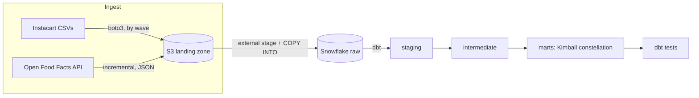

# Retail Data Warehouse on AWS S3 + Snowflake

[](https://github.com/jinchaoplumbliu-dev/Enterprise-Retail-Data-Warehouse-Pipeline/actions/workflows/ci.yml)

An ELT pipeline built on the Instacart Online Grocery dataset (~3.4M orders,
~33M order line items). Two ingestion paths — batch CSVs replayed as
incremental waves, and a live product API pulled on a watermark — land in an
S3 data lake; Snowflake loads them through an external stage, dbt builds a
Kimball dimensional model on top, and Airflow orchestrates the runs with dbt
tests acting as a quality gate. The extract/load logic is unit-tested and CI
runs pytest + `dbt parse` on every push.

This started as a Postgres project; I rebuilt it on S3 + Snowflake to work
with a real cloud warehouse: external stages, storage integrations, `VARIANT`
for semi-structured data, and keyless auth on both sides.

## Architecture



Airflow runs locally on the Astro CLI. There are two pipelines plus a one-time
setup DAG: `instacart_pipeline` does `upload -> COPY -> dbt build` for one wave
of the batch data, and `off_api_pipeline` does `extract -> COPY -> dbt build`
for the API path on a daily schedule.

### Ingestion paths

**Batch.** The six Instacart CSVs. The dataset is a static snapshot, so to make
the loads realistic I replay the transactional tables in waves keyed by
`order_number` (wave 1 = everyone's first order, wave 2 = second orders, and so
on). A prep script splits the big files once into per-wave CSVs; each pipeline
run then uploads and loads a single wave. The line-item files only carry
`order_id`, so the split builds an `order_id -> order_number` map from
`orders.csv` and appends the wave number as an extra column.

**API.** An incremental extractor for the Open Food Facts product API, with
pagination, rate limiting and retry/backoff on 5xx. It pages newest-modified
first and stops once it crosses the high-water mark, which is simply
`max(last_modified_t)` already loaded in Snowflake, so there is no separate
state store. The raw JSON lands in S3 under a `dt=YYYY-MM-DD/` partition and is
copied into a Snowflake `VARIANT` column; dbt flattens it schema-on-read.

## Data model

A fact constellation: two facts at different grains sharing conformed
dimensions, plus a nutrition dimension from the API path.

| Model | Grain | Materialisation |
| --- | --- | --- |
| `fact_order_items` | one product in one order (~33M) | incremental |
| `fact_orders` | one order | table |
| `dim_product` | product, with aisle + department flattened in | table |
| `dim_user` | user + behavioural attributes | table |
| `dim_time` | day-of-week x hour-of-day (168 rows) | table |
| `dim_food_product` | Open Food Facts product + nutrition per 100g | table |

`order_id`, `order_number` and `add_to_cart_order` stay on the facts as
degenerate dimensions. Surrogate keys are deterministic hashes of the natural
keys (`dbt_utils.generate_surrogate_key`), which keeps them stable across full
rebuilds and lets the facts recompute the key from the natural key instead of
doing a 33M-row lookup join against the dimensions.

## Design notes

Things I decided on purpose, and why:

- One S3 prefix per table (`raw/<table>/...`), so the external stage maps
  cleanly and a `COPY INTO` can target one table's files, or a single wave's
  file for the incremental loads.

- No access keys anywhere. Snowflake reaches S3 through a storage integration
  that assumes a scoped IAM role (trust pinned to Snowflake's IAM principal
  plus an external id, read access limited to this bucket's `raw/` prefix).
  Local extraction authenticates through IAM Identity Center, so boto3 uses
  short-lived SSO credentials; the container gets the host's SSO session
  mounted read-only.

- Idempotency at both layers. The raw wave load `DELETE`s the wave and re-COPYs
  it with `FORCE = TRUE` (otherwise Snowflake's load history silently skips a
  file it has seen before, which breaks the re-run). Downstream,
  `fact_order_items` is a dbt incremental model (`delete+insert` on
  `unique_key=[order_id, product_id]`) advancing on an `order_number`
  watermark. Re-running any wave or extract never duplicates rows.

- The API watermark lives in the warehouse. The extractor asks Snowflake for
  `max(last_modified_t)` before pulling, mirroring how the wave watermark
  works, instead of maintaining a separate state file.

- Schema-on-read for the API. The full product JSON is kept in the `VARIANT`
  column; dbt pulls out only the fields the model needs and deduplicates by
  product code keeping the latest version. If I need more attributes later
  they are already landed.

- `prior` and `train` orders are unioned into the facts (both are completed
  orders; a `source` flag records which split a row came from). `test` orders
  have no basket lines and are dropped in staging.

- No synthetic calendar. The dataset only has `order_dow` and
  `order_hour_of_day`, so `dim_time` is the honest 168-row cross join.
  Instacart never documented which day `0` is; the day-name mapping in the
  model is flagged as an assumption.

## Tech stack

- AWS S3 for the landing zone / lake
- Snowflake as the warehouse (`VARIANT` for the JSON path)
- dbt-core 1.x + dbt-snowflake + dbt_utils for transformation and tests
- Config-driven Python EL scripts (`boto3`, `snowflake-connector-python`)
- Apache Airflow 3 on Astro Runtime for orchestration
- IAM Identity Center (SSO) for local AWS auth; storage integration for
  Snowflake-to-S3

## Project structure

```text
.
├── config/
│   ├── tables.yml              # batch EL contract: tables, columns, load mode
│   └── api_sources.yml         # API ingestion contract (Open Food Facts)
├── data/                       # source CSVs + generated waves (gitignored)
├── src/
│   ├── prep/split_waves.py     # one-time wave split by order_number
│   ├── upload_to_s3.py         # batch: boto3 -> S3
│   ├── load_to_snowflake.py    # batch: COPY INTO from stage
│   ├── extract_api.py          # api: incremental pull -> S3 (watermark)
│   └── load_api_to_snowflake.py # api: COPY JSON into VARIANT
├── snowflake/
│   ├── 01_setup.sql            # warehouse / database / role / grants
│   ├── 02_storage_integration.sql  # S3 <-> Snowflake trust
│   └── 03_stage.sql            # external stage + file format
├── dbt/instacart/              # dbt project (staging / intermediate / marts)
├── dags/                       # instacart_setup, instacart_pipeline, off_api_pipeline
├── tests/                      # pytest unit tests for the EL scripts
├── .github/workflows/ci.yml    # CI: pytest + dbt parse
├── Dockerfile                  # Astro image (+ isolated dbt venv)
├── docker-compose.override.yml # mounts src/config/dbt/data + ~/.aws into Astro
├── requirements.txt            # Airflow image deps
├── requirements-dbt.txt        # dbt (isolated venv)
└── requirements-dev.txt        # pytest + deps for the unit tests
```

## Running it

You need an AWS account (S3 + IAM Identity Center), a Snowflake account, the
AWS CLI v2, Docker Desktop and the Astro CLI.

1. Copy `.env.example` to `.env` and fill in the bucket and Snowflake details.
   Run `aws configure sso` once to set up the local profile.

2. Provision Snowflake: run `snowflake/01_setup.sql`, then
   `02_storage_integration.sql` (this one is a back-and-forth with the AWS IAM
   console, follow the numbered steps in the file), then `03_stage.sql`.

3. Download the six Instacart CSVs into `data/` (see
   [Kaggle](https://www.kaggle.com/datasets/yasserh/instacart-online-grocery-basket-analysis-dataset))
   and split them into waves with `src/prep/split_waves.py`.

4. Start Airflow and run the DAGs:

   ```bash
   aws sso login --profile instacart   # refresh the SSO session
   astro dev start                     # build the image and start Airflow
   ```

   Trigger `instacart_setup` once, then `instacart_pipeline` per wave with a
   run config (`{"wave": 1}`, `{"wave": 2}`, ...). `off_api_pipeline` runs
   daily on its own.

To check the loads worked:

```sql
-- the line-item fact grows as waves are loaded, with no duplicates
select order_number, count(*) from marts.fact_order_items group by 1 order by 1;

-- referential integrity (expect 0)
select count(*) from marts.fact_order_items f
left join marts.dim_product d on f.product_key = d.product_key
where d.product_key is null;
```

## Data quality

`dbt build` runs the tests on every pipeline run, and a failing test fails the
DAG:

- `unique` / `not_null` on every surrogate key
- `relationships` from each fact key to its dimension
- `accepted_values` on `reordered`
- `dbt_utils.unique_combination_of_columns` on `(order_id, product_id)`, which
  is the guard against incremental-load duplicates
- `unique` / `not_null` on the API product code and its surrogate key

The Python side has unit tests too (`pip install -r requirements-dev.txt`,
then `pytest`): the wave split, the extractor's watermark and retry/backoff
logic, the COPY statement generation and the config contracts. CI runs them on
every push, along with a `dbt parse` to validate the dbt project.

## Credits

Built on the [Instacart Online Grocery Basket Analysis dataset](https://www.kaggle.com/datasets/yasserh/instacart-online-grocery-basket-analysis-dataset)
and the [Open Food Facts](https://world.openfoodfacts.org/) open database.
