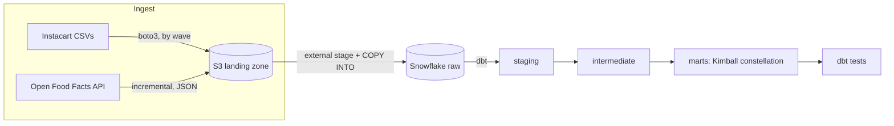

# Retail Data Warehouse on AWS S3 + Snowflake

An end-to-end ELT pipeline on the Instacart Online Grocery dataset (~3.4M orders,
~33M order line items). Two ingestion paths feed an S3 landing zone; Snowflake
loads from S3 via an external stage; dbt models the data into a Kimball
dimensional model; Apache Airflow orchestrates and tests it on every run.

`Data Engineer` · `Analytics Engineer` — cloud data warehousing, dimensional
modelling, incremental ingestion, semi-structured data, orchestration, data
quality.

## What this project demonstrates

- **Cloud ELT on Snowflake** — S3 as a data lake, a storage integration + external
  stage for keyless access, and `COPY INTO` loads (bulk CSV and JSON).
- **Two ingestion patterns** — batch CSV replayed in `order_number` waves, and an
  incremental API extractor with pagination, rate-limit/backoff and a high-water
  mark.
- **Semi-structured data** — API JSON landed into a Snowflake `VARIANT` column and
  flattened schema-on-read in dbt.
- **Dimensional modelling (Kimball)** — a fact constellation: two facts at two
  grains over conformed dimensions, with degenerate dimensions and deterministic
  surrogate keys.
- **Idempotency end to end** — re-running any wave or extract never duplicates
  data, at both the raw and the transformation layer.
- **Data quality as a gate** — dbt tests run inside the pipeline; a failing test
  fails the DAG.
- **Least-privilege security** — AWS access via IAM Identity Center (SSO) with no
  long-lived keys locally, and a Snowflake↔S3 trust scoped to one bucket prefix.

## Architecture



Airflow (run locally on the Astro CLI) orchestrates each pipeline:
`load → dbt build` for the warehouse, and `extract → load → dbt build` for the
API. The analytics warehouse is Snowflake; compute and storage are separated.

### Ingestion paths

| Path | Source | Cadence | Landing | Load |
|---|---|---|---|---|
| Batch | 6 Instacart CSVs | `order_number` waves | `raw/<table>/` CSV | `COPY INTO` per wave |
| API | Open Food Facts | incremental (daily) | `raw/off_products_api/dt=…/` JSON | `COPY INTO` a `VARIANT` |

## Data model

A fact constellation over conformed dimensions, plus a nutrition dimension from
the API path.

| Model | Grain | Materialisation |
|---|---|---|
| `fact_order_items` | one product in one order (~33M) | **incremental** |
| `fact_orders` | one order | table |
| `dim_product` | product (aisle + department flattened in) | table |
| `dim_user` | user + behavioural attributes | table |
| `dim_time` | day-of-week × hour-of-day (168 rows) | table |
| `dim_food_product` | Open Food Facts product + nutrition per 100g | table |

`order_id`, `order_number` and `add_to_cart_order` are kept as degenerate
dimensions on the facts. Surrogate keys (`product_key`, `user_key`, `time_key`)
are deterministic hashes of the natural keys.

## Key design decisions

- **S3 landing layout: one prefix per table.** Files live under
  `raw/<table>/…`, so the external stage maps cleanly and `COPY INTO`
  targets exactly one table's files — and a single wave's file for incremental
  loads.

- **Keyless S3 access via a storage integration.** Snowflake assumes a scoped
  IAM role (trust pinned to Snowflake's IAM principal + external id); the role's
  policy grants read on only this bucket's `raw/` prefix. No access keys live in
  Snowflake or in the repo.

- **SSO for local AWS, not access keys.** Local extraction authenticates through
  IAM Identity Center, so boto3 uses short-lived session credentials and there
  are no long-lived keys on disk. In the container the host SSO session is
  mounted read-only.

- **Hash surrogate keys, not auto-increment.** `dbt_utils.generate_surrogate_key`
  produces a deterministic key from the natural key — stable across rebuilds and
  independent of insert order. Because the key is a pure function of the natural
  key, the facts **recompute** it instead of joining to dimensions, avoiding a
  33M-row lookup join.

- **`order_number` waves + partitioned landing.** The large files are pre-split
  once into per-wave files, so each wave load is a small, fast `COPY` rather than
  a re-scan of the full file. Line items only carry `order_id`, so the split
  builds an `order_id → order_number` map from `orders` and appends it.

- **Two-layer incrementality, both idempotent.** Raw `DELETE`s the wave then
  `COPY`s it (`FORCE = TRUE` so the reload isn't skipped by load history); the
  line-item fact is a dbt `incremental` model (`delete+insert`,
  `unique_key=[order_id, product_id]`) advancing on an `order_number` watermark.

- **API incrementality from the warehouse.** The extractor pages newest-modified
  first and stops once it crosses the watermark, which is `max(last_modified_t)`
  already in Snowflake — no separate state store, mirroring the wave watermark.

- **Schema-on-read for the API.** Product JSON lands in a `VARIANT` column; dbt
  flattens the fields it needs and deduplicates by product code keeping the
  latest version. New attributes can be picked up later without reloading.

- **`prior ∪ train`, `test` excluded.** Both `prior` and `train` are completed
  orders and are unioned into the facts (with a `source` flag); `test` orders
  have no basket and are dropped.

- **Cyclical time, no synthetic calendar.** The dataset has only `order_dow` +
  `order_hour_of_day`; `dim_time` captures the cyclical time honestly (168 rows),
  with the day-of-week → day-name mapping flagged in-model as an assumption.

## Tech stack

- **Storage / lake:** AWS S3
- **Warehouse:** Snowflake (separated compute + storage, `VARIANT` for JSON)
- **Transformation / tests:** dbt-core 1.x + dbt-snowflake, dbt_utils
- **Extract & Load:** config-driven Python (`boto3`, `snowflake-connector-python`)
- **Orchestration:** Apache Airflow 3 (Astro Runtime, local)
- **AWS auth:** IAM Identity Center (SSO); storage integration for Snowflake↔S3
- **Modelling:** Kimball star / constellation schema

## Project structure

```text
.
├── config/
│   ├── tables.yml              # batch EL contract: tables, columns, load mode
│   └── api_sources.yml         # API ingestion contract (Open Food Facts)
├── data/                       # source CSVs + generated waves (gitignored)
├── src/
│   ├── prep/split_waves.py     # one-time wave split by order_number
│   ├── upload_to_s3.py         # batch: boto3 -> S3
│   ├── load_to_snowflake.py    # batch: COPY INTO from stage
│   ├── extract_api.py          # api: incremental pull -> S3 (watermark)
│   └── load_api_to_snowflake.py # api: COPY JSON into VARIANT
├── snowflake/
│   ├── 01_setup.sql            # warehouse / database / role / grants
│   ├── 02_storage_integration.sql  # S3 <-> Snowflake trust
│   └── 03_stage.sql            # external stage + file format
├── dbt/instacart/              # dbt project (staging / intermediate / marts)
├── dags/                       # Airflow: instacart_setup, instacart_pipeline, off_api_pipeline
├── Dockerfile                  # Astro image (+ isolated dbt venv)
├── docker-compose.override.yml # mounts src/config/dbt/data + ~/.aws into Astro
├── requirements.txt            # Airflow image deps
└── requirements-dbt.txt        # dbt (isolated venv)
```

## Running it

Prerequisites: an AWS account (S3 + IAM Identity Center), a Snowflake account,
the AWS CLI v2, Docker Desktop and the Astro CLI.

1. **Configure credentials** — copy `.env.example` to `.env` and fill in the
   bucket and Snowflake details; `aws configure sso` once for the local profile.

2. **Provision Snowflake** — run `snowflake/01_setup.sql`,
   `02_storage_integration.sql` (with the IAM role handshake) and `03_stage.sql`.

3. **Get the data** — download the 6 Instacart CSVs into `data/` (see
   [Kaggle](https://www.kaggle.com/datasets/yasserh/instacart-online-grocery-basket-analysis-dataset))
   and split them into waves with `src/prep/split_waves.py`.

4. **Run locally** —

   ```bash
   aws sso login --profile instacart   # refresh the SSO session
   astro dev start                      # build the image and start Airflow
   ```

   Trigger `instacart_setup` once, then `instacart_pipeline` per wave
   (`{"wave": 1}`, `{"wave": 2}`, …). The `off_api_pipeline` runs the Open Food
   Facts ingestion on a daily schedule.

### Verify

```sql
-- the line-item fact grows as waves are loaded, with no duplicates
select order_number, count(*) from marts.fact_order_items group by 1 order by 1;

-- referential integrity (expect 0)
select count(*) from marts.fact_order_items f
left join marts.dim_product d on f.product_key = d.product_key
where d.product_key is null;
```

## Data quality

`dbt build` runs the test suite on every pipeline run:

- `unique` / `not_null` on every surrogate key
- `relationships` from each fact key to its dimension (referential integrity)
- `accepted_values` on `reordered` (`0` / `1`)
- `dbt_utils.unique_combination_of_columns` on `(order_id, product_id)` — the
  guard against incremental-load duplicates
- `unique` / `not_null` on the API product code and surrogate key

## Credits

Built on the [Instacart Online Grocery Basket Analysis dataset](https://www.kaggle.com/datasets/yasserh/instacart-online-grocery-basket-analysis-dataset)
and the [Open Food Facts](https://world.openfoodfacts.org/) open database.
